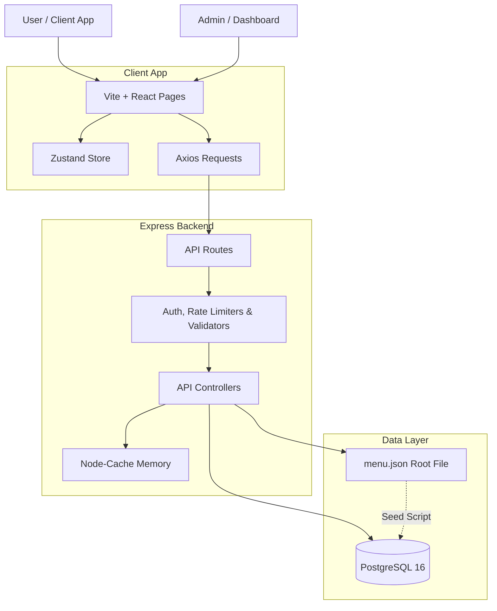

# Silvertip Cafe — Project Progress & Debugging Report
> A detailed technical document recording the phase-by-phase implementation, system architecture, initial bugs, and their diagnostic resolution.

---

## 1. Project Overview & Current Status
**Silvertip Cafe** is a premium digital menu and marketing application built on the **PERN stack (PostgreSQL, Express.js, React, Node.js)**. The application serves two primary interfaces:
1. **Public Brand Website & Digital Menu:** Customers can browse home details, explore the menu with category filters, submit messages/bookings through a contact form, and get live help from a floating AI chatbot widget.
2. **Admin Control Panel:** Secured with JWT authentication, allowing admin users to add/edit/delete menu items, view customer messages/submissions, and automatically sync data.

The project features a **two-way synchronicity model**:
- **Database (PostgreSQL 16):** Provides high-performance querying, relational integrity, and fuzzy search indexes.
- **Local Data File (`menu.json`):** Serves as the single, human-readable source of truth. Admin operations automatically synchronize database changes to `menu.json` using atomic temporary-file swaps.

---

## 2. Chronological Progress (Phase 0 to Upgrade completion)

### 📂 Phase 0: Project Scaffolding & Seed Scaffolding
- **Repository Setup:** Scaled out directory structures for `server/` (Express) and `client/` (React+Vite) and configured root-level commands in `package.json` to launch client and server concurrently.
- **Database Initialization:** Drafted schemas in PostgreSQL for:
  - `categories` (slug, display order, page groups).
  - `menu_items` (name, price, price variants, veg flags, availability flags, search vectors).
  - `admins` (email, hashed password).
- **Core Seed Data (`menu.json`):** Formatted the extracted restaurant menu PDF pages into a standardized JSON file.
- **Seeding Automation (`seed.js`):** Seed script that recreates database tables, registers default administrator, and imports menu structures.

### 🌐 Phase 1: REST API Development
- **Database Client (`config/db.js`):** Configured a database connection pool (`pg.Pool`) reading from database environment variables.
- **Public Endpoints:**
  - `GET /api/v1/health` – Returns database connection health status.
  - `GET /api/v1/categories` – Returns category details and item counts.
  - `GET /api/v1/menu` – Returns available items organized by category.
  - `GET /api/v1/search` – Directs search queries to PostgreSQL using a `tsvector` query and `pg_trgm` fuzzy text matching index.
- **Security Middleware Chain:**
  - `helmet` configurations setting modern, secure HTTP response headers.
  - `cors` setup restricted to client domains.
  - `express-rate-limit` for rate limiting API consumers.

### 🎨 Phase 2: Frontend Menu UI with Glassmorphism & Layout Upgrade
- **Design Tokens (`index.css`):** Base style sheet supporting translucent glass borders, blur layers, radial gradients, and premium gold-amber accent highlights.
- **Routing Infrastructure:** Setup React Router v6 mapping home, menu, contact, and admin routes.
- **Layout Shell:** Constructed transparent-to-solid navbar transitions, mobile responsive burger drawers, and detailed footer navigation links.
- **Home Landing Section:** Created a cinematic parallax hero, about section grid, horizontal featured items list, and a keyboard-accessible testimonials slider.

### 🔐 Phase 3: Contact Form & Backend Contact Endpoint
- **Contact Submissions Table:** New DB table `contact_submissions (id, name, email, subject, message, created_at, read)` created.
- **Secure Endpoint:** Built `POST /api/contact` validation and rate limiter middleware.
- **Admin Control Integration:** Added messages management into the Admin Dashboard allowing reading and marking customer emails.

### 🤖 Phase 4: Chatbot Assistant Integration
- **Contextual Chatbot:** Built a floating `<ChatBotWidget>` widget available across all views.
- **Backend Chat Gateway:** Added `POST /api/chat` server-side route proxying calls to the LLM backend with context payloads populated from Zustand stores.
- **Token Guards & Rate Limiting:** Enforces strict token context budgets and custom rate limits per IP to control API usage.

---

## 3. Bug Ledger & Diagnostic Resolution

### 🐞 Bug 1: Veg Toggle & Category Truncation Layout Bug
- **Symptoms:** Category tabs bar truncated on mobile viewports and Veg toggle overlapped text.
- **Diagnostic Action:** Replaced `w-full` with `flex-1 min-w-0` on category headers and added `flex-shrink-0` to the toggle wrapper.

### 🐞 Bug 2: Draggable Navbar Category Scrollbar
- **Symptoms:** Category bar scroll was hidden on desktop making it impossible to scroll horizontal categories.
- **Diagnostic Action:** Created custom category scrollbar styling tracks matching the amber aesthetic.

### 🐞 Bug 3: CRUD Validation Failures on Partial Updates
- **Symptoms:** Administrative updates (like toggling availability switches) failed with HTTP 400 validation error.
- **Diagnostic Action:** Isolated validation requirements by writing `validateMenuItemUpdate` where properties are marked `.optional()`.

### 🐞 Bug 4: Admin Soft-Delete Operations
- **Symptoms:** Deleting an item threw SQL errors indicating missing `is_deleted` column.
- **Diagnostic Action:** Modified backend handlers to use try/catch blocks falling back to checking availability flags, and corrected frontend state updating logic.

---

## 4. Current Architecture Diagram



---

## 5. Verification Plan & Commands

### Automated Tests
Execute backend unit, integration, and flow tests:
```bash
npm run test --prefix server
```

### Manual Verification
1. **Public Views:** Navigate routes `/`, `/menu`, and `/contact` verifying responsiveness and component performance.
2. **Contact Form:** Post a submission, confirm validation triggers, and check if it stores in database tables.
3. **Chatbot Widget:** Ask questions about the menu options to confirm LLM responses.
4. **Admin Dashboard:** Access the dashboard to view contact submissions and edit items.

