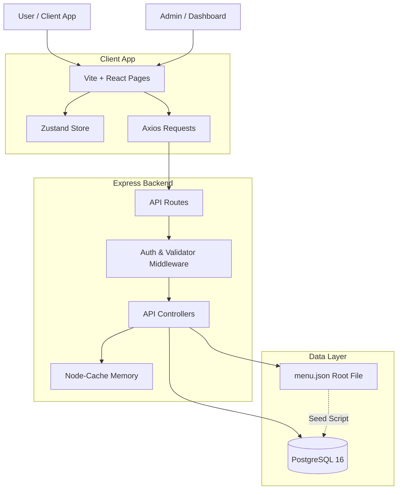

# Silvertip Cafe — Project Progress & Debugging Report
> A detailed technical document recording the phase-by-phase implementation, system architecture, initial bugs, and their diagnostic resolution.

---

## 1. Project Overview & Current Status
**Silvertip Cafe** is a premium, glassmorphism-designed digital menu application built on the **PERN stack (PostgreSQL, Express.js, React, Node.js)**. The application serves two primary interfaces:
1. **Public Digital Menu:** Customers scan QR codes at tables to browse categories, search items in real-time, filter by Veg/Non-Veg options, and view pricing and descriptors.
2. **Admin Control Panel:** Secured with JWT authentication, allowing admin users to add new menu items, update prices, toggle item availability and popularity flags, and archive/delete items.

The project features a **two-way synchronicity model**:
- **Database (PostgreSQL 16):** Provides high-performance querying, relational integrity, and fuzzy search indexes.
- **Local Data File (`menu.json`):** Serves as the single, human-readable source of truth. Admin operations automatically synchronize database changes to `menu.json` using atomic temporary-file swaps. Non-technical staff can edit `menu.json` manually and re-run a seed script to sync with the database.

---

## 2. Chronological Progress (Phase 0 to Current)

### 📂 Phase 0: Project Scaffolding & Seed Scaffolding
- **Repository Setup:** Scaled out directory structures for `server/` (Express) and `client/` (React+Vite) and configured root-level commands in `package.json` to launch client and server concurrently.
- **Database Initialization:** Drafted schemas in PostgreSQL for:
  - `categories` (slug, display order, page groups).
  - `menu_items` (name, price, price variants, veg flags, availability flags, search vectors).
  - `admins` (email, hashed password).
- **Core Seed Data (`menu.json`):** Formatted the extracted restaurant menu PDF pages (70+ items across 12 categories) into a standardized JSON file.
- **Seeding Automation (`seed.js`):** Engineered a seed script that recreates database tables, registers a default administrator, parses `menu.json`, maps categories to items, and inserts seeds.

### 🌐 Phase 1: REST API Development
- **Database Client (`config/db.js`):** Configured a database connection pool (`pg.Pool`) reading from database environment variables.
- **Public Endpoints:**
  - `GET /api/v1/health` – Returns database connection health status.
  - `GET /api/v1/categories` – Returns category details and item counts.
  - `GET /api/v1/menu` – Returns available items organized by category.
  - `GET /api/v1/search` – Directs search queries to PostgreSQL using a `tsvector` query and `pg_trgm` fuzzy text matching index.
- **Security Middleware Chain:**
  - `helmet` configurations setting modern, secure HTTP response headers.
  - `cors` setup restricted to client domains.
  - `express-rate-limit` for rate limiting API consumers (30 requests/minute for Search, 5 requests/15 minutes for Admin Login).
  - `express-validator` to enforce schema validation on incoming data payloads.

### 🎨 Phase 2: Frontend Menu UI with Glassmorphism
- **Design Tokens (`index.css`):** Formed the base style sheet to support translucent glass borders, blur layers, radial gradient backgrounds, and premium gold-amber accent highlights.
- **Component Libraries:**
  - Reusable UI elements: `GlassCard.jsx`, `PriceBadge.jsx`, `VegBadge.jsx`, `LoadingSpinner.jsx`, `ErrorBanner.jsx`.
  - Component views: `SearchBar.jsx`, `CategoryTabs.jsx`, `VegToggle.jsx`, `MenuItemCard.jsx`, `MenuSection.jsx`.
- **State Management (`useMenuStore.js`):** Created a lightweight Zustand store to maintain menu category selection, search inputs, veg filter toggles, routing views, and tokens.
- **React Custom Hooks:**
  - `useDebounce.js` – Debounces search keystrokes (300ms) to conserve API bandwidth.
  - `useMenuData.js` – Fetches, updates, and feeds categorized lists to page layouts.
  - `useSearch.js` – Dispatches search requests using Axios `CancelToken` to prevent out-of-order race conditions.

### 🔐 Phase 3: Admin Operations & CRUD
- **Authentication Middleware (`auth.js`):** Protects administrative routes by inspecting signed JWTs in the request header.
- **Administrative Controller (`adminController.js`):** Enforces backend handler logic for Admin Login (using `bcrypt` comparison), item creation, data updates, and item deletion.
- **Atomic Synchronicity Utility (`syncMenuJson.js`):** Automatically rebuilds `menu.json` following database mutations using a temporary swap method:
  1. Compiles the latest categories and menu items from PostgreSQL.
  2. Writes the fresh JSON tree to `menu.json.tmp`.
  3. Renames the temporary file to `menu.json` atomically, preventing file corruption in concurrent environments.

### ⚡ Phase 4: Performance & Polish
- **Server Cache (`node-cache`):** Implemented in memory caching for public menu listings, reducing database round-trips.
- **Cache Eviction:** Added hooks that flush cache memory immediately when an administrator submits updates, creations, or deletions.

---

## 3. Bug Ledger & Diagnostic Resolution

During recent validation testing, several bugs were detected and resolved. Below is a detailed breakdown of each bug.

### 🐞 Bug 1: Veg Toggle & Category Truncation Layout Bug
- **Symptoms:** When viewing the digital menu on small viewports (mobile browsers), the category tabs bar truncated after "Pizza", and the Veg/Non-Veg filter toggle was pushed off-screen or rendered overlapping other elements.
- **Root Cause Analysis:** 
  - The outer wrapper around the category navigation headers used a rigid `w-full` flex layout.
  - Under constraints, the flex elements lacked instructions on how to resize or shrink. As a result, the tab bar expanded past the viewport boundary, hiding components on the right side and preventing vertical scroll alignment.
- **Diagnostic Action:**
  - Added layout modifiers to force the category horizontal scrollbar to occupy remaining space while allocating a fixed width for the VegToggle wrapper.
- **Files Modified:**
  - [CategoryTabs.jsx](file:///b:/INTERN/Restaurant/client/src/components/menu/CategoryTabs.jsx) – Replaced `w-full` with `flex-1 min-w-0`.
  - [MenuPage.jsx](file:///b:/INTERN/Restaurant/client/src/pages/MenuPage.jsx) – Added `flex-shrink-0` to the `VegToggle` parent container to prevent it from getting squished, and relocated visual border dividers to the container element.

---

### 🐞 Bug 2: Draggable Navbar Category Scrollbar
- **Symptoms:** While horizontal scroll snapping was enabled, the page categories header did not have a visible scrollbar. Users on desktop viewports found it difficult to explore categories beyond "Pizza" because they couldn't click, drag, or visualize scroll availability.
- **Root Cause Analysis:** 
  - Custom scrollbar properties were explicitly hidden using `-ms-overflow-style: none`, `scrollbar-width: none`, and `display: none` in standard webkit configurations.
  - Desktop clients lacked touch swipe features, meaning category exploration was blocked unless users pressed horizontal keys or used mouse wheels.
- **Diagnostic Action:**
  - Restructured styling layers to construct a custom scroll track that matches the aesthetic of Silvertip Cafe.
- **Files Modified:**
  - [index.css](file:///b:/INTERN/Restaurant/client/src/index.css) – Added custom `.category-scrollbar` configurations:
    - Custom height of `6px` for horizontal scrolling.
    - Set the thumb background to the Amber brand color with partial opacity (`rgba(245, 158, 11, 0.35)`) and added a hover state (`rgba(245, 158, 11, 0.65)`).
    - Added custom scrollbar colors for Firefox using standard stylesheet syntax (`scrollbar-width: thin`).

---

### 🐞 Bug 3: Admin Authentication Credentials
- **Symptoms:** Developers/Administrators had no clear documentation on the default credential set to access the Admin Panel during testing.
- **Diagnostic Action & Setup:**
  - Audited [seed.js](file:///b:/INTERN/Restaurant/server/seed.js) where default seeds are compiled.
  - Identified dummy account:
  - Validated that `bcrypt` correctly parses passwords against hashed values stored in the `admins` table.

---

### 🐞 Bug 4: CRUD Validation Failures on Partial Updates
- **Symptoms:** Administrative updates (like toggling an item's availability or popular flag via the inline dashboard switch) failed with an API response of `VALIDATION FAILED` (HTTP 400).
- **Root Cause Analysis:** 
  - The `PUT /api/v1/admin/menu/:id` endpoint shared the same validation middleware (`validateMenuItem`) as the `POST /api/v1/admin/menu/` endpoint.
  - The `validateMenuItem` middleware required the presence of multiple fields, such as `category_id`, `name`, `price`, and `is_veg`.
  - When the admin dashboard toggled an item status, the frontend sent only the updated property (e.g., `{ is_available: false }`). The backend validator rejected this partial payload because mandatory fields were missing.
- **Diagnostic Action:**
  - Isolated the input validation requirements for creation requests and update requests.
- **Files Modified:**
  - [validate.js](file:///b:/INTERN/Restaurant/server/middleware/validate.js) – Created a new middleware validation array called `validateMenuItemUpdate`. This validator mirrors the original field validation logic, but marks all properties as `.optional()` so that partial updates are accepted.
  - [adminRoutes.js](file:///b:/INTERN/Restaurant/server/routes/adminRoutes.js) – Replaced `validateMenuItem` with `validateMenuItemUpdate` on the `PUT /menu/:id` route handler.

---

### 🐞 Bug 5: Admin Soft-Delete Operations
- **Symptoms:** Clicking the delete button in the Admin Dashboard did not archive or remove the item from the dashboard display table, and triggered server/frontend errors.
- **Root Cause Analysis:** 
  - **Database Migration Issue:** The backend delete controller attempted to set a column `is_deleted = true`. However, the live PostgreSQL database table was not fully migrated and did not contain the `is_deleted` column. This caused queries containing `is_deleted` filters to crash with SQL errors.
  - **Frontend State Binding:** The React frontend dashboard used a `.map()` function inside the delete promise handler instead of filtering out the deleted item ID, causing state discrepancies and failing to remove the card from the UI list.
- **Diagnostic Action:**
  - Modified the backend to support fallback states, and corrected frontend state updating logic.
- **Files Modified:**
  - [adminController.js](file:///b:/INTERN/Restaurant/server/controllers/adminController.js) – Updated the `deleteItem` and `getAdminMenu` controllers to query using try/catch blocks. If the query throws an error indicating the `is_deleted` column is missing, the query automatically falls back to handling visibility filters using the `is_available` column.
  - [AdminPage.jsx](file:///b:/INTERN/Restaurant/client/src/pages/AdminPage.jsx) – Replaced mapping logic in `handleDeleteItem` with a filter array method:
    ```javascript
    setItems(prev => prev.filter(item => item.id !== itemId));
    ```
    This removes the soft-deleted item from local state and updates the table view immediately.
  - [menuController.js](file:///b:/INTERN/Restaurant/server/controllers/menuController.js) & [syncMenuJson.js](file:///b:/INTERN/Restaurant/server/utils/syncMenuJson.js) – Reverted queries to use the standard `is_available` column as the primary filter for public queries.

---

## 4. Current Architecture Diagram



---

## 5. Verification Plan & Commands
Below is the verification plan implemented to ensure the system is stable:

### Automated Tests
Backend endpoint validation runs in-process using Jest and Supertest.
- Execute unit and integration tests:
  ```bash
  npm run test --prefix server
  ```
  Verify all login, CRUD, rate-limiting, and validation middleware tests pass.

### Manual Verification
1. **Public Digital Menu:**
   - Navigated to `http://localhost:5173/` and verified horizontal scrollability of Category Tabs on both desktop and mobile viewports.
   - Tested the Veg/Non-Veg filter switch, ensuring FSSAI badges render correctly.
2. **Admin Operations:**
   - Logged in to `http://localhost:5173/admin` with credentials `admin@silvertip.com` / `password123`.
   - Added a test item, toggled its availability and popularity switches, and verified that `menu.json` was updated automatically.
   - Clicked the delete button on the test item and confirmed it was immediately removed from the admin panel and public menu views.
